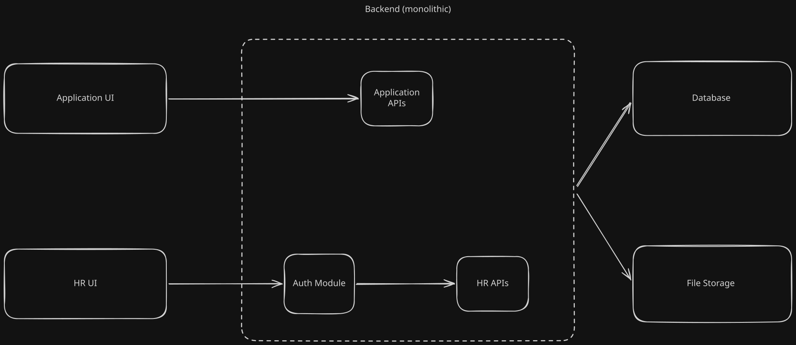
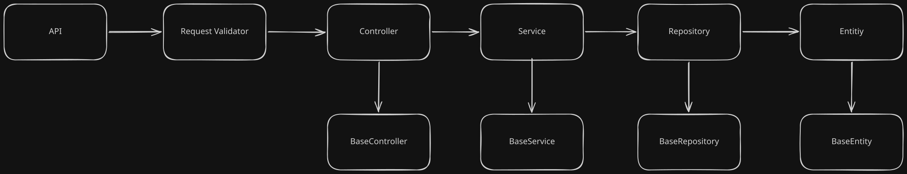
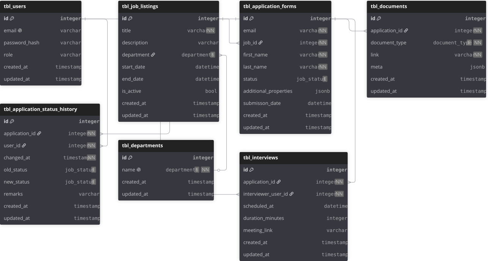

# HR & Applicant Tracking System (ATS)

## 📌 Overview
This project is a comprehensive Human Resources and Applicant Tracking System designed to manage the entire hiring pipeline. It provides dedicated interfaces for both job applicants and HR personnel, powered by a robust monolithic backend. The system handles job postings, application submissions, interview scheduling, document management, and status tracking.

---

## 💻 Tech Stack

**Frontend**
*   **Framework:**  
*   **Language:** 

**Backend**
*   **Framework:** 
*   **Language:** 
*   **Authentication:**  (Stateless Auth)

**Infrastructure & Data**
*   **Database:** 
*   **File Storage:**  (S3-compatible object storage for resumes/documents)
*   **Containerization:**  (for local development and orchestration)

---

## Project Status

- [x] Monorepo workspace setup
- [x] Backend API architecture
- [x] Authentication logic (JWT & RBAC)
- [ ] Database migrations
- [ ] Frontend dashboard (Next.js)
- [ ] User authentication flow
- [ ] Job postings & department management
- [ ] Candidate tracking & applications
- [ ] Docker containerization
- [ ] Testing & deployment

---

## 🏗️ System Architecture

The high-level architecture follows a client-server model with a monolithic backend, as illustrated in the architecture diagram below.

### Components
*   **Client Interfaces:**
    *   **Application UI:** The public-facing frontend where candidates can browse job listings and submit their applications.
    *   **HR UI:** A secure, internal dashboard for HR staff to manage job postings, review applicants, and schedule interviews.
*   **Backend (Monolithic):**
    *   **Application APIs:** Handles requests from the public Application UI (e.g., fetching active jobs, submitting forms).
    *   **Auth Module:** Manages authentication and authorization, specifically securing access from the HR UI.
    *   **HR APIs:** Protected endpoints handling administrative tasks like updating application statuses and managing users.
*   **Infrastructure:**
    *   **Database:** A relational database storing all structured application data.
    *   **File Storage:** A dedicated storage system for handling applicant documents (e.g., resumes, cover letters, portfolios).

---

## ⚙️ Backend Request Flow

The backend is built using a strict layered architecture pattern to ensure separation of concerns, maintainability, and scalability, as shown in the request flow diagram below.

### Request Lifecycle
1.  **API Routing:** Incoming requests are routed to specific endpoints.
2.  **Request Validator:** Ensures the incoming payload meets expected schemas and constraints before processing.
3.  **Controller:** Handles the HTTP request/response cycle and delegates business logic to the Service layer. Inherits common logic from a `BaseController`.
4.  **Service:** Contains the core business logic of the application. Inherits from a `BaseService`.
5.  **Repository:** Manages data access and abstracts database queries. Inherits from a `BaseRepository`.
6.  **Model:** Represents the data structure and schema. Inherits from a `BaseModel`.

---

## 🗄️ Database Schema

The system utilizes a relational database structure designed to track the full lifecycle of an application, detailed in the entity-relationship diagram below.

### Core Tables:
*   **`tbl_users`**: Manages system users (HR staff, interviewers, admins) including role-based access control and encrypted credentials.
*   **`tbl_departments`**: A lookup table for organizational departments.
*   **`tbl_job_listings`**: Stores job postings with active dates, department links, and descriptions.
*   **`tbl_application_forms`**: The central table linking candidates to specific jobs, tracking their current application status and dynamic form properties (stored as JSONB).
*   **`tbl_application_status_history`**: An audit log tracking every status change an application undergoes, recording who made the change and when.
*   **`tbl_documents`**: Stores metadata and links to physical files in the File Storage (e.g., resumes tied to an `application_id`).
*   **`tbl_interviews`**: Manages scheduled interviews, linking applications to specific interviewer users, and storing meeting durations and links.

---

## 🚀 Key Features
*   **Role-Based Access:** Secure HR dashboard isolated from the public applicant portal.
*   **Full Audit Trail:** Detailed tracking of application status changes for transparency and compliance.
*   **Dynamic Application Forms:** Support for additional/custom properties via JSONB database fields.
*   **Integrated Interview Scheduling:** Connect applicants with interviewers and meeting links directly within the platform.
*   **Document Management:** Abstracted file storage for handling sensitive applicant documents.